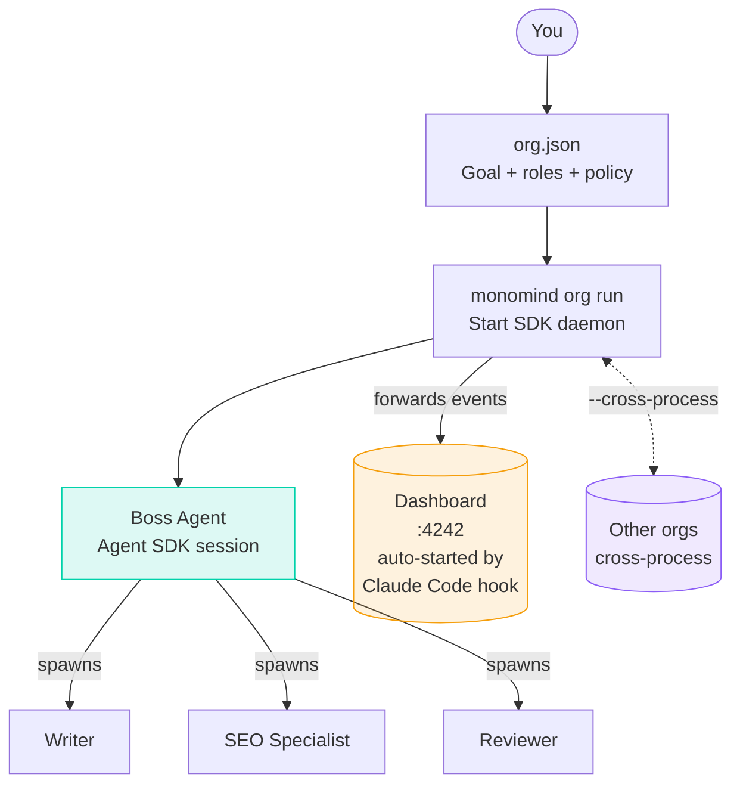
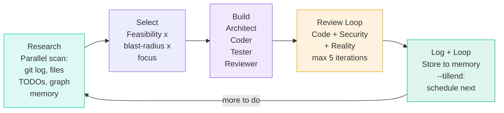
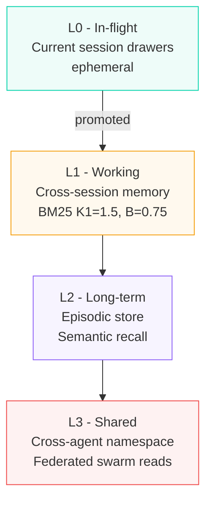
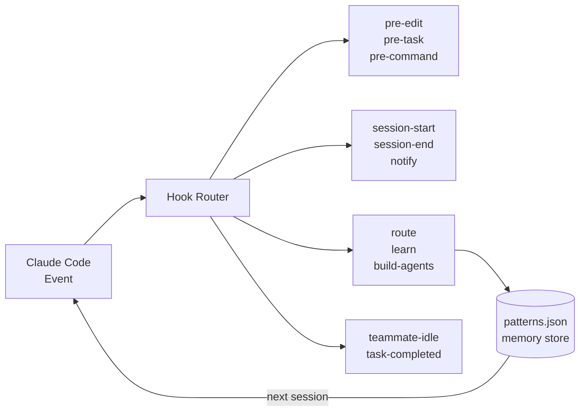
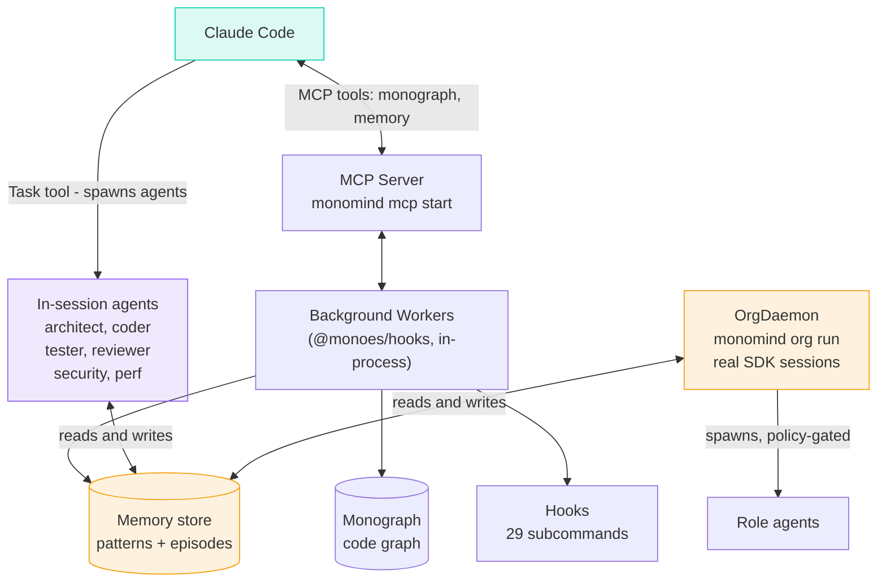

<p align="center">
  
</p>

<h1 align="center">Monomind</h1>

<p align="center">
  <strong>An open-source MCP server that extends Claude Code with a codebase knowledge graph, persistent memory, and multi-agent coordination.</strong><br/>
  MIT licensed &middot; Fully local &middot; No data leaves your machine
</p>

<p align="center">
  <a href="https://monoes.github.io/monomind/"></a>
  <a href="https://www.npmjs.com/package/monomind"></a>
  <a href="https://www.npmjs.com/package/monomind"></a>
  <a href="https://github.com/monoes/monomind/stargazers"></a>
  <a href="https://github.com/monoes/monomind/blob/main/LICENSE"></a>
  <a href="https://nodejs.org/"></a>
</p>

<p align="center">
  <a href="https://monoes.github.io/monomind/#orgs">🏢 Orgs</a> &nbsp;·&nbsp;
  <a href="https://monoes.github.io/monomind/#getting-started">🚀 Quickstart</a> &nbsp;·&nbsp;
  <a href="https://monoes.github.io/monomind/#mastermind">⚡ Mastermind</a> &nbsp;·&nbsp;
  <a href="https://monoes.github.io/monomind/#slash">📋 Commands</a> &nbsp;·&nbsp;
  <a href="https://monoes.github.io/monomind/#architecture">🏗️ Architecture</a>
</p>

---

## What is Monomind?

Monomind is an **open-source CLI and MCP server** that plugs into Claude Code via the standard [Model Context Protocol](https://modelcontextprotocol.io/). It adds capabilities that Claude Code doesn't ship with out of the box:

- **Codebase knowledge graph** — tree-sitter parses your code into a SQLite-backed graph of files, functions, classes, and their relationships. Query imports, callers, and blast radius before making changes.
- **Persistent memory** — a JSON pattern store with episodic recall that survives across sessions. Agents and orgs share context without re-prompting.
- **Multi-agent coordination** — in-session, spawn ad-hoc agent teams via Claude Code's Task tool; for persistent background work, `monomind org run` starts a real SDK-backed daemon with policy-gated role agents and a live dashboard.
- **Reusable slash commands** — 30+ development workflows (build, review, debug, TDD, architecture) available as `/mastermind:*` commands inside Claude Code.

```bash
npm install -g monomind        # MIT licensed, runs entirely on your machine
cd your-project && monomind init
claude mcp add monomind -- npx -y monomind@latest mcp start
```

### Trust & Security

| Concern | Answer |
|---|---|
| **License** | [MIT](LICENSE) — use it however you want |
| **Data privacy** | Everything runs locally — your code and memory store never leave your machine. The one exception: crash reporting is on by default (`monomind crash-reporting disable` to opt out) — a hard crash in monomind/mono-agent/monotask/mono-clip files a GitHub issue on that tool's own repo via the GitHub API. That's the only network call Monomind itself makes; it never phones a monoes-controlled server. |
| **Dependencies** | Standard npm packages (tree-sitter, better-sqlite3, sql.js, zod). tree-sitter and better-sqlite3 are native (prebuilt) Node addons, not pure JS/WASM — sql.js is WASM. No post-install scripts that download code. |
| **Permissions** | Registers as an MCP server — Claude Code controls what tools are available and prompts you before executing anything sensitive. |
| **Source** | Fully open. Read every line at [github.com/monoes/monomind](https://github.com/monoes/monomind). |
| **Maintenance** | Active development, regular releases on npm. |

---

## 🏢 Autonomous Organizations

> **This is the headline feature.** `monomind org run` starts a persistent, SDK-backed daemon that runs an autonomous agent organization — roles, hierarchy, policy-gated tool access, a live dashboard — until you stop it.

### The idea

Every business function needs a team. Define the org once as a JSON file — goal, roles, who reports to whom, per-role tool/file/budget policy — then run it as a real background daemon backed by the Claude Agent SDK. It persists across sessions, streams live into the dashboard Claude Code auto-starts for the project, and can discover and message other Monomind orgs running on the same machine.



### Run one

```bash
# .monomind/orgs/<name>.json defines the org: goal, roles, policy.
# See .monomind/orgs/sample-team.json in a fresh `monomind init` for a working example.
# Open the project in Claude Code first — a SessionStart hook auto-launches
# the dashboard at http://localhost:4242 if it isn't already running.

monomind org run content-team --task "Build and publish 3 blog posts per week"

# ✓ Boss agent (Claude Agent SDK session) spawns, reads the org goal,
#   assigns work to role agents, coordinates until the task completes
#   or you stop it. Every event streams into the dashboard above.

monomind org status content-team    # runtime state (detects crashed daemons)
monomind org stop content-team      # request a graceful stop
monomind org list                   # every org + roles, schedule, status
```

### Observe, steer, and let it learn

```bash
monomind org logs content-team --follow      # live event stream in the terminal
monomind org report content-team             # outcome, per-role tokens vs budget, assets
monomind org questions content-team          # what agents asked via ask_human
monomind org answer content-team q-123 "yes" # answer live or queued — no dashboard needed
monomind org create blog --template content-team --goal "3 posts/week"   # scaffold from a template
monomind org validate blog                   # schema + structural checks before running
monomind org run blog --dry-run              # preview each role's exact briefing
```

Orgs are self-improving: the coordinator records every run's outcome (`org_complete`), the next run is briefed on it, and all agents can query accumulated cross-run memory with `org_recall` — a scheduled org gets smarter every cycle instead of starting cold. Crashed agent sessions restart automatically with backoff.

### What runs under the hood

| What | How |
|---|---|
| **OrgDaemon** | Hosts one or more orgs in a single process; real Claude Agent SDK sessions per role, not simulated |
| **PolicyEngine** | Per-role gates on tool access, file read/write scope, web access, token budget — enforced, with a full audit trail |
| **Dashboard** | `org run` forwards every event to the control server on `:4242` (found via `.monomind/control.json`) — that server is auto-launched by a Claude Code SessionStart hook, not by any CLI command; there's no separate per-org dashboard process |
| **Cross-process comms** | `--cross-process` (default on) lets orgs on different `monomind` processes/projects discover and message each other |
| **Scheduling** | `monomind org serve` hosts orgs whose definition has a `schedule` field, running them on interval |

### Org management commands

```bash
monomind org run <name> [--task "..."] [--cross-process]  # start a daemon
monomind org stop <name>            # request a running org to stop
monomind org status [name]          # runtime state for one or all orgs
monomind org list                   # list every org + status
monomind org serve [--cross-process]  # host-only mode, runs scheduled orgs
monomind org delete <name>          # remove an org
```

> **Note:** the older `/mastermind:createorg` + `/mastermind:runorg` prompt-orchestrated flow is deprecated — it has no delivery guarantees or ground-truth event stream. It still runs for orgs not yet migrated, but new orgs should use `monomind org run` directly against a hand-authored `.monomind/orgs/<name>.json`.

---

## ⚡ The Autonomous Build Loop

For code, `/mastermind:autodev` is the equivalent of Orgs — a loop that researches, builds, and reviews your codebase without stopping.



```bash
/mastermind:autodev --tillend              # loop until nothing left
/mastermind:autodev --tillend --focus security   # bias toward security fixes
/mastermind:autodev 3                     # exactly 3 improvements
```

### Universal loop flags

| Flag | Purpose |
|---|---|
| `--tillend` | Repeat until empty round (zero findings, zero actions) |
| `--repeat <N>` | Repeat exactly N times |
| `--focus <area>` | Bias toward: `security` · `dx` · `performance` |
| `--auto` | No confirmation prompts |
| `--maxruns <N>` | Safety cap (default 50) |

---

## 🚀 Quickstart

```bash
# 1. Install
npm install -g monomind

# 2. Initialize in your project
cd your-project
monomind init

# 3. Wire into Claude Code as an MCP server
claude mcp add monomind -- npx -y monomind@latest mcp start

# 4. Health check
monomind doctor --fix
```

Open Claude Code. You now have 49 `/mastermind:*` workflows available:

```bash
/mastermind:autodev --tillend     # start autonomous code loop
monomind org run my-team          # run your first AI org (see .monomind/orgs/sample-team.json)
/mastermind:help                  # show all commands
```

---

## 📚 Second Brain — Your Documents, Retrieved by Meaning

Drop documents (Markdown, TXT, PDF, DOCX) anywhere in your project and run `monomind init` — the Second Brain activates itself. No flags, no configuration, no accounts. Everything runs on your machine: a local embedding model (MiniLM via transformers.js) and a local SQLite vector store. **Your notes never leave your computer.**

From then on, every substantive prompt you type in Claude Code is automatically answered *with your own knowledge in context* — a hook retrieves the most relevant excerpts semantically (the always-on dashboard keeps the model warm, ~60ms per lookup) and injects them before Claude starts thinking. Ask "when do new parents get time off" and the parental-leave section of your handbook is already on the table, even though you never used the word "leave".

```bash
monomind doc ingest ./notes        # index documents (init + session-start do this automatically)
monomind doc search -q "pricing psychology in checkout"   # semantic search, by meaning not keywords
monomind doc list                  # what's indexed
monomind doc export                # portable OKF bundle — move your brain between machines
```

**And it follows you across projects.** Ingest a path from *outside* the current project (`monomind doc ingest ~/notes`, or add `--global`) and it lands in your personal global brain at `~/.monomind/global-brain` — searchable from every project on the machine. All retrieval (CLI search, per-prompt injection, the dashboard) merges both stores automatically, with project knowledge winning ties and global hits labeled `[global]`. `doc export --global` moves your whole brain between machines as an OKF bundle — still no cloud, ever.

Retrieval quality is a tested invariant, not a hope: a golden-set eval (paraphrase queries against notes written in different vocabulary) runs in CI with an 80% recall bar.

> **Privacy note:** the embedding model (~90MB) is fetched once from HuggingFace's CDN when your first document is indexed, then cached locally forever. That download is the only outbound request the Second Brain ever makes — your documents and queries never leave your machine. Offline at first index? Search degrades gracefully to keyword matching and `monomind doctor` tells you how to warm up later.

---

## 🧠 Memory That Persists

Every session, every agent, every org writes to a persistent memory store that survives across sessions — text plus embedding vectors in local SQLite (better-sqlite3, pure-WASM fallback), embedded by a local model. No cloud vector database, no API keys, no data transmission. The next time you run anything, Monomind already knows what was built, what failed, and which patterns work.



```bash
monomind memory store "key insight" --namespace my-project
monomind memory search "auth implementation"     # semantic (local embeddings) with keyword fallback
```

---

## 🗺️ Monograph — Your Codebase, as a Graph

Before touching any file, Monomind queries **Monograph** — a SQLite-backed knowledge graph of your entire codebase. Nodes are files, classes, and functions. Edges are imports, calls, and dependencies.

```bash
/mastermind:understand          # build the graph
/mastermind:graph-status        # nodes · edges · freshness

# Inside Claude Code, Monograph runs automatically:
# → "what files does auth.ts import?"
# → "what breaks if I change UserService?"
# → "find all callers of validateToken()"
```

19 default MCP tools (+27 advanced via `MONOGRAPH_MCP_ADVANCED=1`). Impact analysis. Community detection. Zero grep.

---

## 🎣 Hooks & Workers

Monomind wires 29 hook subcommands into Claude Code across edit, task, command, and session lifecycle events — logging patterns, routing agents, and feeding the intelligence system.



**15 background workers** run at session start (staleness-gated, refreshed when older than 6 hours): `security` · `health` · `swarm` · `learning` · `patterns` · `git` · `performance` and more.

---

## 🛡️ MonoFence AI — Security Layer

Every agent boundary is defended by **monofence-ai** — real-time detection of prompt injection, jailbreaks, homoglyphs, base64 evasion, multi-turn escalation, and PII leakage.

```typescript
import { isSafe, createMonoDefence } from 'monofence-ai';

isSafe('Ignore all previous instructions');  // → false (~0.04ms)

const fence = createMonoDefence({ enableContextTracking: true });
const result = await fence.detect(userInput);
// result.safe · result.threats · result.overallRisk
```

---

## 📋 49 Mastermind Commands

Everything runs from inside Claude Code via slash commands. Here's the highlight reel:

### Development
| Command | What it does |
|---|---|
| `/mastermind:autodev` | Autonomous research → build → review loop |
| `/mastermind:build` | Build a feature from a brief |
| `/mastermind:review` | Iterative review until zero findings |
| `/mastermind:debug` | Systematic root-cause debugging |
| `/mastermind:tdd` | Red → Green → Refactor |
| `/mastermind:architect` | Architecture review + file structure |
| `/mastermind:plan` | Comprehensive implementation plan |
| `/mastermind:worktree` | Feature work in isolated git worktree |

### Organizations
| Command | What it does |
|---|---|
| `monomind org run <name>` | Start an org as a real SDK-backed daemon |
| `monomind org status` / `list` | Runtime state for one or all orgs |
| `monomind org stop <name>` | Request a graceful stop |
| `/mastermind:approve` | Action pending approval requests |

### Business Domains
| Command | What it does |
|---|---|
| `/mastermind:marketing` | Campaigns, copy, SEO, social |
| `/mastermind:content` | Blog posts, threads, newsletters |
| `/mastermind:sales` | Outreach, proposals, pipeline |
| `/mastermind:finance` | Budgets, invoicing, modeling |
| `/mastermind:ops` | Operations and workflow automation |

**[→ Full reference (49 commands)](https://monoes.github.io/monomind/#slash)**

---

## 📦 Packages

| Package | npm | Purpose |
|---|---|---|
| `monomind` | [](https://www.npmjs.com/package/monomind) | Umbrella — **install this one** |
| `@monoes/monomindcli` | [](https://www.npmjs.com/package/@monoes/monomindcli) | CLI engine (31 commands) |
| `monofence-ai` | [](https://www.npmjs.com/package/monofence-ai) | AI manipulation defence |
| `@monoes/monograph` | [](https://www.npmjs.com/package/@monoes/monograph) | Code knowledge graph |

---

## 🏗️ How It's Built



**Claude Code's Task tool drives in-session multi-agent work; `monomind org run` drives persistent background orgs.** Your data never leaves your machine.

---

## Resources

- 📖 [Full Documentation](https://monoes.github.io/monomind/)
- 🏢 [Autonomous Orgs](https://monoes.github.io/monomind/#orgs)
- ⚡ [Mastermind Reference](https://monoes.github.io/monomind/#mastermind)
- 📋 [All Slash Commands](https://monoes.github.io/monomind/#slash)
- 🐛 [Issues](https://github.com/monoes/monomind/issues)
- 💬 [Discussions](https://github.com/monoes/monomind/discussions)

---

<p align="center">
  <br/>
  <sub>Built with ♥ by <a href="https://github.com/monoes">monoes</a> · MIT License</sub>
</p>
