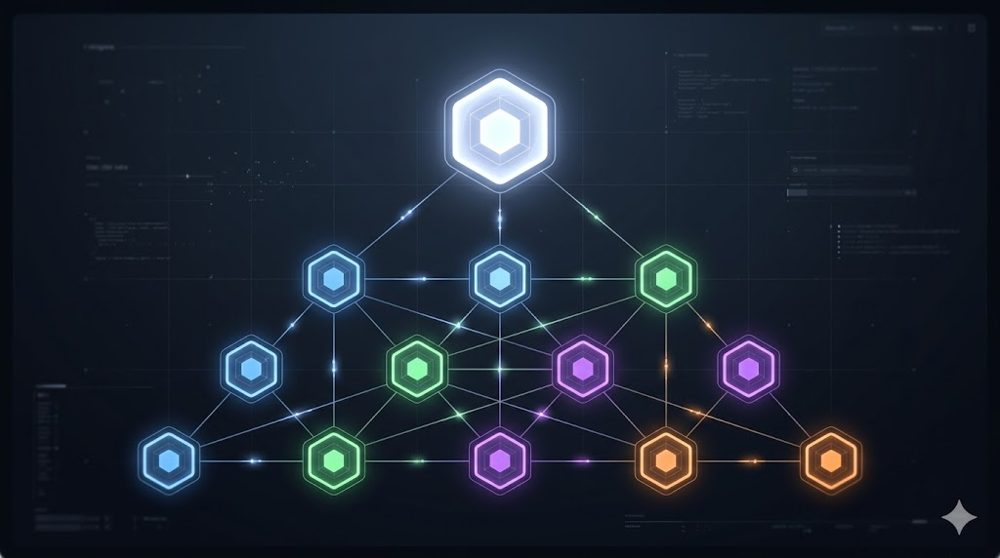

<p align="center">
  
</p>

<p align="center">
  
</p>

<h1 align="center">Monomind</h1>

<p align="center">
  <strong>Build. Learn. Evolve. Without stopping.</strong>
</p>

<p align="center">
  The self-learning orchestration layer that turns Claude Code<br/>
  into an autonomous, multi-agent engineering team.
</p>

<p align="center">
  <a href="https://monoes.github.io/monomind/"></a>
  <a href="https://www.npmjs.com/package/monomind"></a>
  <a href="https://www.npmjs.com/package/monomind"></a>
  <a href="https://github.com/nokhodian/monomind/stargazers"></a>
  <a href="https://github.com/nokhodian/monomind/blob/main/LICENSE"></a>
  <a href="https://nodejs.org/"></a>
</p>

<p align="center">
  <a href="https://monoes.github.io/monomind/">📖 Full Docs</a> &nbsp;&bull;&nbsp;
  <a href="#quickstart">Quickstart</a> &nbsp;&bull;&nbsp;
  <a href="#what-monomind-does">What It Does</a> &nbsp;&bull;&nbsp;
  <a href="#features">Features</a> &nbsp;&bull;&nbsp;
  <a href="#commands">Commands</a> &nbsp;&bull;&nbsp;
  <a href="#memory--intelligence">Memory</a>
</p>

---

## What is Monomind?

You already use Claude Code. Monomind makes it **autonomous**.

Type one command. Walk away. Come back to a clean codebase.

```bash
/mastermind:autodev --tillend --focus security
```

Monomind researches your project, selects the highest-impact improvement, builds it with a coordinated agent chain, reviews until zero findings — then repeats. Indefinitely. Until there's nothing left to fix.

> **Without Monomind:** You prompt Claude, wait, review, iterate.  
> **With Monomind:** You set a direction. Monomind executes.

---

## Quickstart

```bash
# Install
npm install -g monomind

# Initialize in your project
cd your-project
monomind init

# Wire into Claude Code
claude mcp add monomind npx monomind mcp start

# Start the background daemon
monomind daemon start
```

That's it. Open Claude Code and start orchestrating.

**[→ Full setup guide](https://monoes.github.io/monomind/#getting-started)**

---

## What Monomind Does

### Autonomous Build Loop — `/mastermind:autodev`

The flagship command. Research → Build → Review → Repeat.

```
Phase 1  Research     Parallel scan: git log, file analysis, TODO/FIXME grep,
                      monograph god nodes, memory search for prior work.
                      Returns ranked list of 3-5 improvement candidates.

Phase 2  Selection    Picks by feasibility × blast radius × focus alignment.
                      Stores selection to memory. Avoids repeating past work.

Phase 3  Build        Spawns architect → coder → tester → reviewer chain.
                      Runs with concrete spec and acceptance criteria.

Phase 4  Review Loop  Code Reviewer + Security Engineer + Reality Checker
                      run in parallel. Auto-fixes. Repeats up to 5× until clean.

Phase 5  Log          Records completion. Continues to next improvement.
                      --tillend schedules the next session automatically.
```

```bash
/mastermind:autodev                     # 1 improvement
/mastermind:autodev 5                   # 5 improvements in sequence
/mastermind:autodev --tillend           # run until nothing is left
/mastermind:autodev --focus security    # bias toward security work
/mastermind:autodev --focus dx          # bias toward developer experience
/mastermind:autodev --newfeature 3      # discover & fully deliver 3 brand-new features
                                        # (build → review → document → stage each one)
```

### From Prompt to Coordinated Execution

```
You: "Add webhook delivery with retries and a dead-letter queue"

Monomind:
  1. Software Architect   → designs the system
  2. backend-dev          → implements webhook dispatcher
  3. backend-dev          → implements retry logic with exponential backoff
  4. Database Optimizer   → designs dead-letter queue schema
  5. tester               → writes integration tests
  6. Code Reviewer        → reviews all changes before merge
```

**[→ See all 10 pages of documentation](https://monoes.github.io/monomind/)**

---

## Features

### 230+ Specialized Agents

Not generic assistants — domain experts with targeted system prompts, each optimized for a specific class of work.

| Category | Examples |
|---|---|
| **Engineering** | Backend Architect, Frontend Developer, Database Optimizer, SRE, Embedded Firmware Engineer |
| **Security** | Security Engineer, Threat Detection Engineer, Blockchain Security Auditor |
| **Architecture** | Software Architect, System Architect, Salesforce Architect |
| **Game Dev** | Unity Architect, Unreal Systems Engineer, Godot Scripter, Roblox Systems Scripter |
| **Marketing** | SEO Specialist, TikTok Strategist, Content Creator, Growth Hacker |
| **Product** | Product Manager, Sprint Prioritizer, CRO Specialist, Launch Strategist |
| **AI/ML** | AI Engineer, ML Developer, Data Engineer, Model QA Specialist |
| **Swarm/Consensus** | Hierarchical Coordinator, Mesh Coordinator, CRDT Synchronizer, Quorum Manager |

### Swarm Topologies

Coordinate multiple agents working in parallel on the same problem:

<p align="center">
  
</p>

| Topology | Best For |
|---|---|
| **Hierarchical** | Feature development — coordinator delegates to specialists |
| **Mesh** | Research — all agents share findings peer-to-peer |
| **Hierarchical-Mesh** | Complex projects — structured delegation with cross-talk |
| **Adaptive** | Unknown complexity — topology evolves based on task |
| **Centralized** | Simple tasks — single coordinator, minimal overhead |
| **Hybrid** | Mixed — star topology with selective mesh connections |

**Consensus algorithms:** Raft (leader-based), Byzantine (fault-tolerant up to f < n/3), Gossip (eventually consistent), CRDT (conflict-free), Quorum (majority vote).

```bash
/mastermind          # topology picker — recommends the best option for your task
monomind swarm init --topology hierarchical --agents 8 --strategy specialized
```

### Self-Learning Memory — The Memory Palace

Every interaction makes Monomind smarter:

| Layer | What It Stores | Tech |
|---|---|---|
| **Short-term** | In-flight context (current session) | SQLite + in-memory cache |
| **Long-term** | Persistent knowledge and patterns | AgentDB + HNSW |
| **Contextual** | Summarized episode clusters | RAPTOR consolidation worker |
| **Shared** | Cross-agent state and promotions | PartitionedHNSW |

- **150x–12,500x faster** semantic search via HNSW indexing
- **Hybrid backend** — SQLite for structured data + AgentDB for semantic
- **BM25 + vector** hybrid retrieval — precision + recall
- **Session continuity** — pick up exactly where you left off

### Knowledge Graph — Monograph

30 graph tools that build a full dependency map of your codebase:

```bash
monograph_suggest "add webhook retry logic"  # → ranked relevant files
monograph_query "UserService dependencies"   # → file paths + line numbers
monograph_god_nodes                          # → high-centrality files
monograph_impact "auth.ts"                   # → blast radius before changing
```

Queried automatically before every task. No manual invocation needed.

### Neural Learning — SONA

Self-Optimizing Neural Adaptation learns from every task:

| Mode | Use Case | Latency |
|---|---|---|
| **Real-time** | Interactive sessions | <0.05ms |
| **Balanced** | General usage | 2-5ms |
| **Research** | Deep analysis | 50ms |
| **Edge** | Low-resource | <0.01ms |
| **Batch** | Offline training | — |

- **LoRA fine-tuning** — rank 1–16, domain-specific adaptation
- **EWC++ memory preservation** — λ 1500–2500, prevents catastrophic forgetting
- **Reasoning Bank** — 3-tier storage: volatile / pattern / principle

### 3-Tier Model Routing

Monomind routes every task to the cheapest model that can handle it:

| Tier | Handler | Latency | Cost | Use Cases |
|---|---|---|---|---|
| **1** | Agent Booster (WASM) | <1ms | $0 | Simple transforms — skip the LLM |
| **2** | Haiku | ~500ms | $0.0002 | Low-complexity tasks (<30%) |
| **3** | Sonnet / Opus | 2-5s | $0.003-0.015 | Complex reasoning, architecture |

### 29+ Hooks + 12 Background Workers

Monomind hooks into every phase of your Claude Code workflow:

| Hook | What It Does |
|---|---|
| `pre-task` | Routes to the best agent, suggests topology |
| `post-task` | Learns from outcomes, updates neural patterns |
| `pre-edit` | Context suggestions, blast radius check |
| `post-edit` | Indexes new code into the knowledge graph |
| `session-start` | Restores context, preloads relevant memory |
| `session-end` | Persists learnings, updates metrics |

**Background workers** (12 total): ultralearn, optimize, consolidate, predict, audit, map, preload, deepdive, document, refactor, benchmark, testgaps — all autonomous.

---

## Live Dashboard

Real-time visibility into every project, session, agent, memory operation, route decision, and token spend.

```bash
monomind daemon start    # starts background workers and session tracking
```

Sessions are fully recorded and replayable — full conversation replay with tool breakdown, agent spawns, and memory operations.

---

## Commands

### 53+ CLI Commands

```bash
monomind init                              # Project initialization wizard
monomind agent spawn --type coder          # Spawn a specific agent
monomind swarm init --topology mesh        # Initialize a swarm
monomind memory search "auth patterns"     # Search vector memory
monomind hooks route --task "fix bug"      # Route to best agent
monomind neural train --flash              # enable Flash Attention optimization
monomind doctor --fix                      # Diagnose and auto-fix issues
monomind daemon start                      # Start background workers
```

**[→ Full CLI reference](https://monoes.github.io/monomind/#commands)**

### 160+ Slash Commands (inside Claude Code)

| Command | What It Does |
|---|---|
| `/mastermind:autodev` | Autonomous research → build → review loop |
| `/mastermind:review --tillend` | Keep reviewing and auto-fixing until clean |
| `/mastermind:build <brief>` | Build a specific feature with an agent chain |
| `/mastermind:architect` | System architecture design and review |
| `/mastermind:research` | Deep research with structured output |
| `/mastermind:createtask` | Decompose a spec into executable tasks |
| `/mastermind:idea` | Research → evaluate → create implementation tasks |
| `/mastermind:do` | Execute tasks from the board with parallel agents |
| `/mastermind:review` | Multi-agent iterative review with auto-fix |
| `/mastermind` | Topology picker — recommends best swarm for your task |

**[→ Full slash command reference](https://monoes.github.io/monomind/#slash)**

### `--tillend` — Fully Autonomous Loops

Any command can run autonomously until there's nothing left to do:

```bash
/mastermind:autodev --tillend --focus security
# → runs until every security issue is found and fixed

/mastermind:review --tillend --auto
# → reviews and fixes until zero findings

/mastermind:autodev 5 --tillend --maxruns 20
# → 5 improvements per session, up to 20 sessions
```

The loop uses `ScheduleWakeup` to resume across sessions. A staleness guard prevents duplicate runs. Human-in-loop items pause and wait for your response before continuing.

```bash
# Stop a loop at any time
touch .monomind/loops/{loop-id}.stop
```

---

## Architecture

```
┌─────────────────────────────────────────────────────────────────┐
│                           Monomind                              │
├─────────────────┬───────────────┬──────────────┬───────────────┤
│  230+ Agents    │  Swarm Engine  │ Memory Palace │  Intelligence │
│                 │               │              │               │
│  Specialized    │  6 topologies  │ AgentDB HNSW │  SONA Neural  │
│  agent defs     │  5 consensus   │ Knowledge    │  3-tier       │
│  + 3-tier       │  algorithms    │ Graph        │  routing      │
│  routing        │               │ (Monograph)  │  <0.05ms      │
├─────────────────┴───────────────┴──────────────┴───────────────┤
│                   29+ Hooks + 12 Background Workers             │
├─────────────────────────────────────────────────────────────────┤
│                  MCP Server (stdio / http / WebSocket)          │
├─────────────────────────────────────────────────────────────────┤
│                        Claude Code Runtime                      │
└─────────────────────────────────────────────────────────────────┘
```

### Key Packages

The workspace ships 17 `@monomind/*` packages:

| Package | Purpose |
|---|---|
| `@monoes/monomindcli` | CLI entry point — 43 top-level commands, 230+ agent defs, 160+ slash commands, hooks, MCP server |
| `@monomind/memory` | AgentDB + HNSW vector search, PartitionedHNSW, TierManager, hybrid SQLite backend |
| `@monomind/hooks` | Lifecycle hook bridge, 12 background workers (ultralearn, optimize, consolidate, predict, audit, map, preload, deepdive, document, refactor, benchmark, testgaps) |
| `@monomind/neural` | SONA manager, LoRA weight adaptation, EWC++ Fisher updates, 5 operating modes |
| `@monomind/monograph` | Knowledge graph construction, 30 MCP tools, BM25 + semantic search |
| `@monomind/graph` | AST-based node/edge extraction, community detection, RAPTOR consolidation |
| `@monomind/swarm` | UnifiedSwarmCoordinator, 6 topologies, 5 consensus algorithms |
| `@monomind/security` | Input validation, prompt injection detection, CVE remediation, gVisor sandbox |
| `@monomind/mcp` | MCP server transport (stdio / http / WebSocket) |
| `@monomind/routing` | Two-stage LLM + keyword agent routing, confidence scoring |
| `@monomind/embeddings` | Vector embedding generation and management |
| `@monomind/performance` | Profiling, benchmarking, latency tracking |
| `@monomind/plugins` | IPFS/Pinata plugin registry, install/create/list |
| `@monomind/claims` | Claims-based authorization for agent actions |
| `@monomind/aidefence` | Adversarial input detection, semantic scanning |
| `@monomind/guidance` | Governance control plane, workflow templates, budget management |
| `@monomind/shared` | Shared types, constants, utilities |

---

## Performance

| Metric | Result | Notes |
|---|---|---|
| Vector search speedup | 150x–12,500x via HNSW | Range from Malkov & Yashunin 2018; HNSW implemented in `hnsw-index.ts` |
| Flash Attention speedup | 2.49x–7.47x | CPU-side attention optimization in `monovector/flash-attention.ts`; marked in-progress |
| SONA adaptation target | <0.05ms | Enforced as SLA with runtime warning; marked in-progress |
| Agent routing (LLM) | <2s | Target; Haiku-based routing |
| Agent routing (fallback) | <5ms | Keyword scoring path |
| Session restore | <500ms cold start | Target |
| Memory reduction | 50–75% vs baseline | Target |

---

## Who Uses Monomind?

- **Solo developers** — the power of a full engineering team from one terminal
- **Startups** — ship features 10x faster with autonomous agent pipelines
- **Enterprise teams** — coordinate complex multi-module changes without drift
- **Security teams** — automate audit, CVE triage, and compliance workflows
- **Game studios** — Unity, Unreal, Godot, and Roblox specialists on demand
- **Marketing teams** — content operations with 27 domain-specific marketing agents

---

## Documentation

**Full interactive documentation:** **[monoes.github.io/monomind](https://monoes.github.io/monomind/)**

| Section | Description |
|---|---|
| [Getting Started](https://monoes.github.io/monomind/#getting-started) | Install, configure MCP, run first autonomous loop |
| [Architecture](https://monoes.github.io/monomind/#architecture) | Package map, agent hierarchy, data flows |
| [Memory & Knowledge](https://monoes.github.io/monomind/#memory) | Memory Palace tiers, AgentDB, Monograph graph tools |
| [Hooks & Workers](https://monoes.github.io/monomind/#hooks) | 29+ hook events, 12 workers, settings.json wiring |
| [Swarm Coordination](https://monoes.github.io/monomind/#swarm) | 6 topologies, 5 consensus algorithms, agent hierarchy |
| [Neural Learning](https://monoes.github.io/monomind/#neural) | SONA modes, LoRA, EWC++, Reasoning Bank |
| [CLI Commands](https://monoes.github.io/monomind/#commands) | All 53+ commands with flags and examples |
| [Slash Commands](https://monoes.github.io/monomind/#slash) | All 160+ slash commands across 22 categories |
| [Mastermind](https://monoes.github.io/monomind/#mastermind) | autodev loop, --tillend mechanics, Brain protocol |

---

## Contributing

```bash
git clone https://github.com/nokhodian/monomind.git
cd monomind
pnpm install
monomind doctor --fix
```

See [CONTRIBUTING.md](CONTRIBUTING.md) for guidelines.

---

## License

MIT — See [LICENSE](LICENSE) for details.

---

<p align="center">
  <strong>Stop prompting. Start orchestrating.</strong>
</p>

<p align="center">
  <a href="https://monoes.github.io/monomind/">📖 Docs</a> &nbsp;&bull;&nbsp;
  <a href="https://www.npmjs.com/package/monomind">npm</a> &nbsp;&bull;&nbsp;
  <a href="https://github.com/nokhodian/monomind">GitHub</a> &nbsp;&bull;&nbsp;
  <a href="https://github.com/nokhodian/monomind/issues">Issues</a>
</p>

---

## Acknowledgements

Monomind builds on ideas, patterns, and research from the following projects:

| Repository | Used for |
|---|---|
| [ruvnet/ruflo](https://github.com/ruvnet/ruflo) | Original skeleton that provided the foundational hooks system, swarm coordination, and SPARC agent methodology. |
| [msitarzewski/agency-agents](https://github.com/msitarzewski/agency-agents) | Informs the multi-agent instruction file layout and specialist agent catalog design. |
| [microsoft/autogen](https://github.com/microsoft/autogen) | Provides the human-in-the-loop interrupt gate pattern and auto-retry tool logic in `@monomind/hooks`. |
| [crewAIInc/crewAI](https://github.com/crewAIInc/crewAI) | Provides the multi-tier memory architecture (`ShortTermMemory`, `EntityMemory`, `ContextualMemory`, `LongTermMemory`) in `@monomind/memory`. |
| [langchain-ai/langgraph](https://github.com/langchain-ai/langgraph) | Provides the `SwarmCheckpointer` graph-checkpoint-and-resume pattern and fan-out/fan-in workflow DSL. |
| [All-Hands-AI/OpenHands](https://github.com/All-Hands-AI/OpenHands) | Provides the per-agent `SandboxConfig` sandboxing model and EventStream session replay architecture. |
| [agno-agi/agno](https://github.com/agno-agi/agno) | Provides the `AgentMemory` knowledge-base architecture and team-level agent coordination class. |
| [huggingface/smolagents](https://github.com/huggingface/smolagents) | Provides the explicit planning-before-execution step in `LATSPlanner` and the `PlanStore` persistence layer. |
| [pydantic/pydantic-ai](https://github.com/pydantic/pydantic-ai) | Provides typed agent I/O schema patterns and auto-retry-on-validation-failure used throughout agent contracts. |
| [BerriAI/atomic-agents](https://github.com/KRunchPL/atomic-agents) | Provides `BaseIOSchema` typed agent contracts and `SystemPromptContextProvider` composition patterns. |
| [stanfordnlp/dspy](https://github.com/stanfordnlp/dspy) | Provides the `BootstrapFewShot`/MIPRO prompt optimization pipeline and Bayesian exploration in `PromptOptimizer.optimize()`. |
| [aurelio-labs/semantic-router](https://github.com/aurelio-labs/semantic-router) | Provides the utterance-based `RouteLayer` that replaced static routing codes in the agent dispatcher. |
| [langfuse/langfuse](https://github.com/langfuse/langfuse) | Provides the trace/span/generation observability hierarchy and prompt version management in `@monomind/hooks`. |
| [karpathy/autoresearch](https://github.com/karpathy/autoresearch) | Provides the BASELINE/KEEP/DISCARD experiment loop protocol and time-budget pattern used in `@monomind/graph`. |
| [safishamsi/graphify](https://github.com/safishamsi/graphify) | Provides the AST-based knowledge graph construction, Louvain community detection, and `GRAPH_REPORT.md` format that form `@monomind/graph`. |
| [google/gvisor](https://gvisor.dev) | Provides the `runsc` OCI runtime that reduces container syscall surface to ~50 interceptions, wired into `SandboxConfig.use_gvisor`. |
| [Indirect Injection research](https://arxiv.org/abs/2302.12173) | `validateExternalContent()` in `@monomind/security` applies the injection pattern detection to all externally-sourced tool content. |
| [FOREVER Forgetting Curve](https://arxiv.org/html/2601.03938v1) | `LearningBridge.decayConfidences()` implements the importance-weighted exponential forgetting curve (`importanceScore × e^(−λt)`). |
| [Awesome RLVR](https://github.com/opendilab/awesome-RLVR) | `hooksModelOutcome` `verifier_type` field (tsc/vitest/eslint/llm_judge) provides grounded binary reward signals. |
| [ERL — Experiential Reflective Learning](https://arxiv.org/abs/2603.24639) | Structured `{condition, action, confidence}` heuristics extracted at `hooks_post-task` and injected as ranked hints into `hooks_pre-task`. |
| [A-MEM — Agentic Memory](https://arxiv.org/abs/2502.12110) | Auto-links top-3 HNSW neighbors via `bridgeRecordCausalEdge` after every `bridgeStoreEntry` call in `@monomind/memory`. |
| [Collaborative Memory Promotion](https://arxiv.org/abs/2505.18279) | `checkAndPromoteEntry()` in `SQLiteBackend` auto-promotes entries from `private` to `team` scope after 3+ distinct agent reads within 24 h. |
| [Zep / Graphiti — Bi-Temporal Knowledge Graph](https://arxiv.org/abs/2501.13956) | `MemoryEntry.eventAt` separates event time T from ingestion time T' for bi-temporal filtering without index rebuilds. |
| [HippoRAG 2 — PPR Graph Retrieval](https://arxiv.org/abs/2405.14831) | `MemoryGraph.pprRerank()` expands HNSW candidates one hop via `MemoryEntry.references` edges. |
| [RAPTOR — Recursive Abstractive Tree Indexing](https://arxiv.org/abs/2401.18059) | `RaptorWorker` clusters episodic entries, summarizes each cluster, and stores results as `contextual`-tier entries. |
| [Multi-Agent Reflexion (MAR)](https://arxiv.org/html/2512.20845) | `hooks_post-task` returns `marReflection` on task failure via a Diagnoser/Critic/Aggregator reflection loop. |
| [TextGrad](https://arxiv.org/abs/2406.07496) | Stores `textual_gradient` critiques to the `gradients` memory namespace for injection into the next prompt on failure. |
| [CP-WBFT](https://arxiv.org/abs/2511.10400) | `weightedTally()` scales each agent's vote by confidence in `@monomind/hooks` hive-mind consensus (AAAI 2026). |
| [GraphRAG](https://arxiv.org/abs/2404.16130) | `MemoryGraph.getCommunitySummaries()` prepends community-level descriptors to semantic search results. |
| [MemPalace](https://github.com/nokhodian/mempalace) | Foundation of the memory palace system with BM25 verbatim retrieval, Wing/Room/Hall hierarchy, and temporal knowledge graph. |
| [vercel-labs/agent-browser](https://github.com/vercel-labs/agent-browser) | Native Rust CDP client architecture that powers `npx monomind browse`. |
| [AgentSeal/codeburn](https://github.com/AgentSeal/codeburn) | Token cost attribution model tracking spend by task, tool, model, and project used in `features/codeburn.md`. |
| [fallow-rs/fallow](https://github.com/fallow-rs/fallow) | Dead code detection patterns used in `monograph-tools.ts` via `deadCodePct()` and `unusedDepsPct()`. |
| [pbakaus/impeccable](https://github.com/pbakaus/impeccable) | 27-pattern HTML/CSS anti-pattern detection CLI integrated via `npx impeccable detect` in the `monodesign` skill. |
| [hardikpandya/stop-slop](https://github.com/hardikpandya/stop-slop) | Directly integrated as the `stop-slop` skill for detecting and removing AI writing tells from prose. |
| [obra/superpowers](https://github.com/obra/superpowers) | Forms the complete `superpowers` skill layer providing brainstorming, TDD, systematic debugging, and finishing workflows. |
| [Lum1104/Understand-Anything](https://github.com/Lum1104/Understand-Anything) | Informs `monomind:understand` semantic enrichment and `@monomind/graph` knowledge graph traversal architecture. |
| [nextlevelbuilder/ui-ux-pro-max-skill](https://github.com/nextlevelbuilder/ui-ux-pro-max-skill) | Provides the design system methodology and component-first craft approach that forms the `monodesign` skill. |
| [paperclipai/paperclip](https://github.com/paperclipai/paperclip) | Autonomous business workflow patterns that informed `mastermind:ops`, `mastermind:finance`, and `mastermind:sales`. |

---

## Research Acknowledgements

Monomind implements techniques from peer-reviewed research across distributed systems, machine learning, and software engineering:

| Technique | Paper | Applied In |
|---|---|---|
| HNSW approximate nearest neighbor | Malkov & Yashunin, 2018 — *Efficient and Robust ANN* | `HNSWIndex` and `HnswLite` in `@monomind/memory` vector search |
| Flash Attention | Dao et al., 2022 — *Fast and Memory-Efficient Exact Attention* | Session context compression in `@monomind/hooks` |
| LoRA fine-tuning | Hu et al., 2021 — *Low-Rank Adaptation of Large Language Models* | Pattern distillation DISTILL step in `RvfLearningStore` |
| EWC (Elastic Weight Consolidation) | Kirkpatrick et al., 2017 — *Overcoming Catastrophic Forgetting* | CONSOLIDATE step session persistence in `@monomind/memory` |
| Byzantine fault tolerance | Castro & Liskov, 1999 — *Practical Byzantine Fault Tolerance* | `weightedTally()` in CP-WBFT hive-mind consensus |
| Raft consensus | Ongaro & Ousterhout, 2014 — *In Search of an Understandable Consensus Algorithm* | `RaftManager` swarm coordinator state machine |
| CRDT data structures | Shapiro et al., 2011 — *Conflict-Free Replicated Data Types* | `CrdtSynchronizer` for eventually consistent agent memory |
| Gossip protocols | Demers et al., 1987 — *Epidemic Algorithms for Replicated Database Maintenance* | `GossipCoordinator` cross-agent state propagation |
| Mixture of Experts | Shazeer et al., 2017 — *Outrageously Large Neural Networks* | MoE semantic router for agent task routing |
| Hyperbolic embeddings | Nickel & Kiela, 2017 — *Poincaré Embeddings for Learning Hierarchical Representations* | Code graph hierarchical vector space in `@monomind/memory` |
| Int8 quantization | Dettmers et al., 2022 — *LLM.int8(): 8-bit Matrix Multiplication for Transformers* | Weight compression for neural pattern memory footprint reduction |
| GOAP planning | Orkin, 2004 — *Applying Goal-Oriented Action Planning to Games* | `code-goal-planner` and `sublinear-goal-planner` agents |
| Self-play RL | Silver et al., 2017 — *Mastering Chess and Shogi by Self-Play* | Pattern reinforcement loop in ReasoningBank |
| Hierarchical memory | Tulving, 1972 — *Episodic and Semantic Memory* | AgentDB episodic/semantic namespace split in `@monomind/memory` |
| PageRank influence | Page et al., 1998 — *The PageRank Citation Ranking* | `pagerank-analyzer` agent and `MemoryGraph` graph centrality scoring |
| Hindsight Experience Replay | Andrychowicz et al., 2017 — *HER: Hindsight Experience Replay* | HER policy learner in the RL router |
| SPARC methodology | Agile/TDD literature | `sparc-coord`, `sparc-coder`, `specification`, `pseudocode`, and `refinement` agents |
| Sublinear algorithms | Various — approximation theory | `sublinear-goal-planner`, `matrix-optimizer`, and `trading-predictor` agents |
