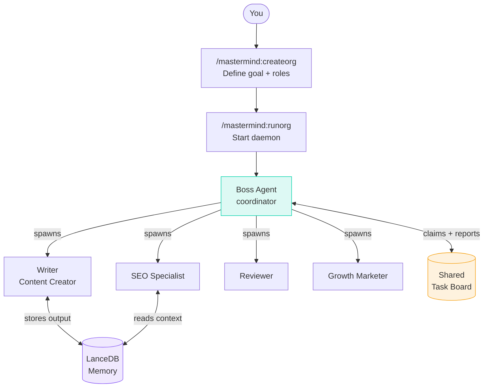
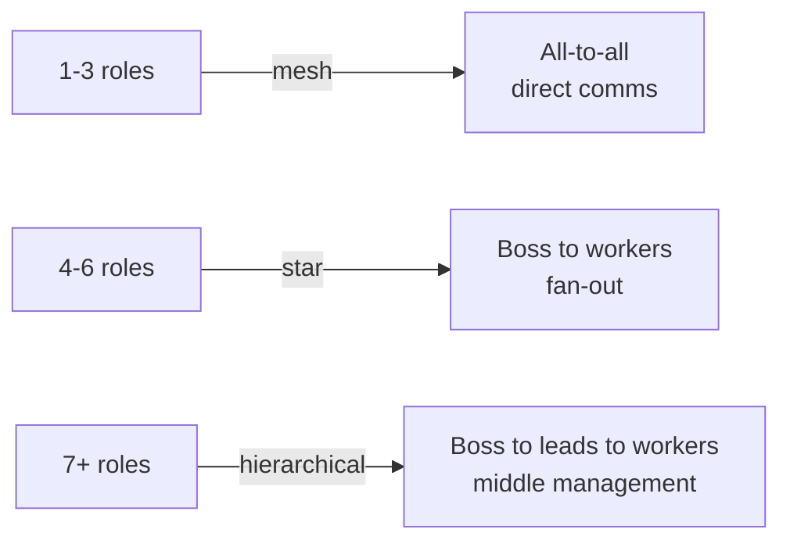
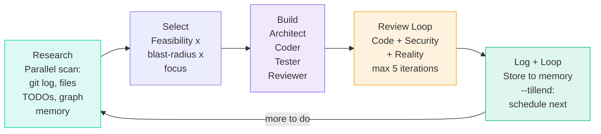
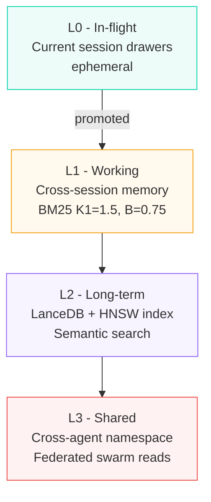
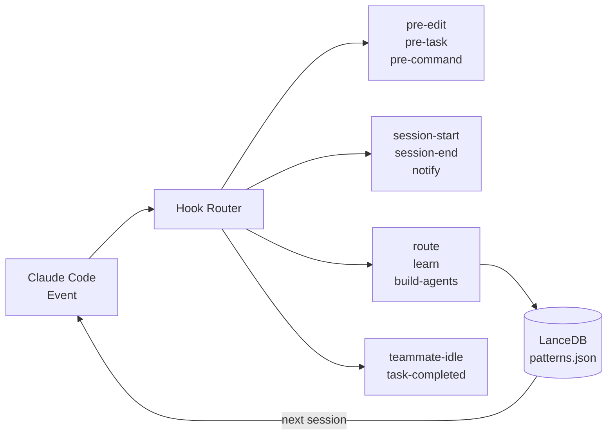
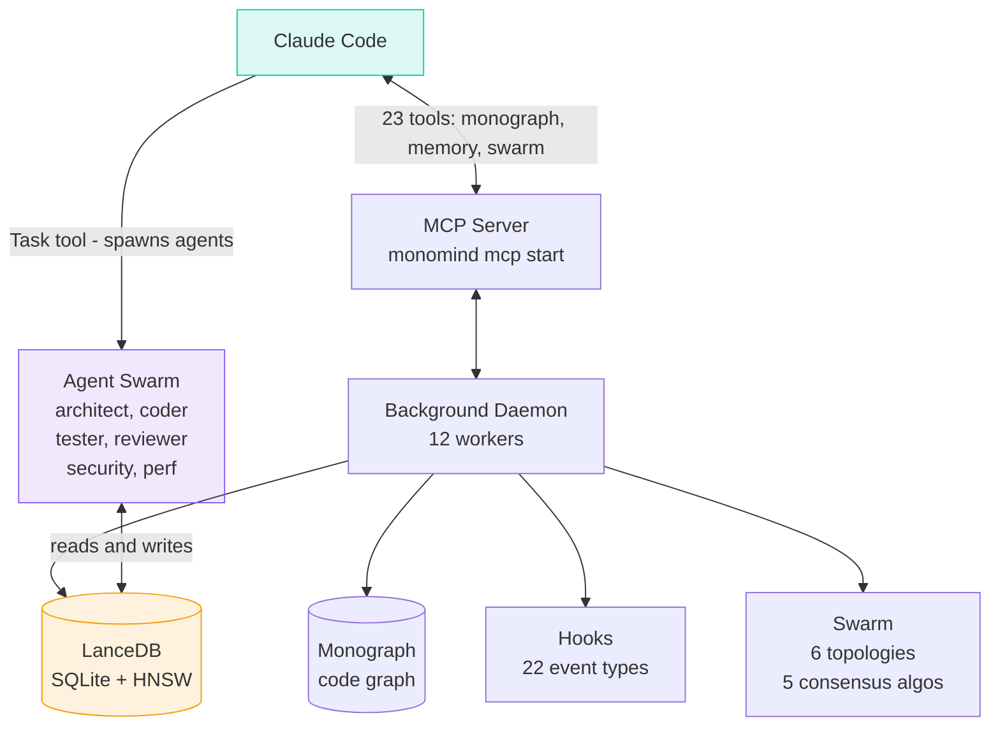

<p align="center">
  
</p>

<h1 align="center">Monomind</h1>

<p align="center">
  <strong>Hire an AI team. Set a goal. Walk away.</strong><br/>
  Autonomous Claude Code orchestration with persistent memory, self-coordinating agent orgs, and a codebase knowledge graph.
</p>

<p align="center">
  <a href="https://monoes.github.io/monomind/"></a>
  <a href="https://www.npmjs.com/package/monomind"></a>
  <a href="https://www.npmjs.com/package/monomind"></a>
  <a href="https://github.com/monoes/monomind/stargazers"></a>
  <a href="https://github.com/monoes/monomind/blob/main/LICENSE"></a>
  <a href="https://nodejs.org/"></a>
</p>

<p align="center">
  <a href="https://monoes.github.io/monomind/#orgs">🏢 Orgs</a> &nbsp;·&nbsp;
  <a href="https://monoes.github.io/monomind/#getting-started">🚀 Quickstart</a> &nbsp;·&nbsp;
  <a href="https://monoes.github.io/monomind/#mastermind">⚡ Mastermind</a> &nbsp;·&nbsp;
  <a href="https://monoes.github.io/monomind/#slash">📋 Commands</a> &nbsp;·&nbsp;
  <a href="https://monoes.github.io/monomind/#architecture">🏗️ Architecture</a>
</p>

---

## What is Monomind?

Claude Code is already powerful. Monomind makes it **run itself**.

Install once. Wire it into Claude Code. Then instead of prompting Claude to do individual tasks, you tell Monomind what outcome you want — and it assembles a team, coordinates the work, and delivers.

```bash
# Assemble an AI content team and let it run
/mastermind:createorg content-team "publish 3 SEO-optimized posts per week"
/mastermind:runorg --org content-team

# Or run the autonomous code improvement loop
/mastermind:autodev --tillend --focus security
```

That's it. Come back later.

---

## 🏢 Autonomous Organizations

> **This is the headline feature.** Build a persistent AI organization — roles, hierarchy, shared task board — and start it as a background daemon that runs without you.

### The idea

Every business function needs a team. Monomind lets you design that team in one command, then run it forever. The org persists across sessions. It checkpoints, recovers from failures, and coordinates its agents through a shared task board — all automatically.



### Two commands to a running org

**Step 1 — Design it:**

```
/ mastermind:createorg content-team
  "Build and publish 3 blog posts per week on AI dev tools"

Deriving roles from goal...

╔ ORG: content-team
║ TOPOLOGY: star (5 roles)

  boss      → coordinator
  writer    → Content Creator
  reviewer  → reviewer
  marketer  → Growth Hacker
  seo       → SEO Specialist

Type "go" to save, or describe changes.
→ go

✓ Saved .monomind/orgs/content-team.json
  → Run: /mastermind:runorg --org content-team
```

**Step 2 — Start it:**

```bash
/mastermind:runorg --org content-team

# Boss agent spawns in background
# Coordinates all roles via shared task board
# Checkpoints every 30 minutes
# Loops until you stop it
```

### What runs under the hood

| What | How |
|---|---|
| **Boss agent** | Coordinator type, no supervisor — owns the goal |
| **Role agents** | Spawned on demand, specialized by task type |
| **Task board** | Todo → Doing → Done, shared across all agents |
| **Memory** | All output stored in org-scoped LanceDB namespace |
| **Checkpoint** | State saved every 30 min — survives crashes and restarts |
| **Governance** | `auto` (free), `board` (approve sensitive), `strict` (approve all external actions) |

### Topology is auto-derived



### Org management commands

```bash
/mastermind:createorg <name> "<goal>"   # design org from a goal
/mastermind:runorg --org <name>         # start as background daemon
/mastermind:orgs                        # list all orgs + status
/mastermind:orgstatus --org <name>      # detailed status for one org
/mastermind:stoporg --org <name>        # stop a running org
/mastermind:approve                     # review pending approval requests
```

---

## ⚡ The Autonomous Build Loop

For code, `/mastermind:autodev` is the equivalent of Orgs — a loop that researches, builds, and reviews your codebase without stopping.



```bash
/mastermind:autodev --tillend              # loop until nothing left
/mastermind:autodev --tillend --focus security   # bias toward security fixes
/mastermind:autodev 3                     # exactly 3 improvements
```

### Universal loop flags

| Flag | Purpose |
|---|---|
| `--tillend` | Repeat until empty round (zero findings, zero actions) |
| `--repeat <N>` | Repeat exactly N times |
| `--focus <area>` | Bias toward: `security` · `dx` · `performance` |
| `--auto` | No confirmation prompts |
| `--maxruns <N>` | Safety cap (default 50) |

---

## 🚀 Quickstart

```bash
# 1. Install
npm install -g monomind

# 2. Initialize in your project
cd your-project
monomind init

# 3. Wire into Claude Code as an MCP server
claude mcp add monomind npx monomind mcp start

# 4. Start the background daemon
monomind daemon start

# 5. Health check
monomind doctor --fix
```

Open Claude Code. You now have 80+ slash commands available:

```bash
/mastermind:autodev --tillend     # start autonomous code loop
/mastermind:createorg my-team     # create your first AI org
/mastermind:help                  # show all commands
```

---

## 🧠 Memory That Persists

Every session, every agent, every org writes to **LanceDB** — a hybrid SQLite + HNSW vector store that survives across sessions. The next time you run anything, Monomind already knows what was built, what failed, and which patterns work.



```bash
monomind memory store "key insight" --namespace my-project
monomind memory search "auth implementation"     # BM25 + semantic hybrid
```

---

## 🗺️ Monograph — Your Codebase, as a Graph

Before touching any file, Monomind queries **Monograph** — a SQLite-backed knowledge graph of your entire codebase. Nodes are files, classes, and functions. Edges are imports, calls, and dependencies.

```bash
/mastermind:understand          # build the graph
/mastermind:graph-status        # nodes · edges · freshness

# Inside Claude Code, Monograph runs automatically:
# → "what files does auth.ts import?"
# → "what breaks if I change UserService?"
# → "find all callers of validateToken()"
```

23 MCP tools. Impact analysis. Shortest-path queries. Community detection. Zero grep.

---

## 🎣 Hooks & Workers

Monomind wires 22 hook events into Claude Code. Every edit, task, command, and session fires hooks that log patterns, route agents, and train the intelligence system.



**12 background workers** run continuously: `security` · `health` · `swarm` · `learning` · `patterns` · `git` · `performance` and more.

---

## 🛡️ MonoFence AI — Security Layer

Every agent boundary is defended by **monofence-ai** — real-time detection of prompt injection, jailbreaks, homoglyphs, base64 evasion, multi-turn escalation, and PII leakage.

```typescript
import { isSafe, createMonoDefence } from 'monofence-ai';

isSafe('Ignore all previous instructions');  // → false (~0.04ms)

const fence = createMonoDefence({ enableContextTracking: true });
const result = await fence.detect(userInput);
// result.safe · result.threats · result.overallRisk
```

---

## 📋 80+ Slash Commands

Everything runs from inside Claude Code via slash commands. Here's the highlight reel:

### Development
| Command | What it does |
|---|---|
| `/mastermind:autodev` | Autonomous research → build → review loop |
| `/mastermind:build` | Build a feature from a brief |
| `/mastermind:review` | Iterative review until zero findings |
| `/mastermind:debug` | Systematic root-cause debugging |
| `/mastermind:tdd` | Red → Green → Refactor |
| `/mastermind:architect` | Architecture review + file structure |
| `/mastermind:plan` | Comprehensive implementation plan |
| `/mastermind:worktree` | Feature work in isolated git worktree |

### Organizations
| Command | What it does |
|---|---|
| `/mastermind:createorg` | Design an autonomous agent org |
| `/mastermind:runorg` | Start it as a background daemon |
| `/mastermind:orgs` | List all orgs + status |
| `/mastermind:approve` | Action pending approval requests |

### Business Domains
| Command | What it does |
|---|---|
| `/mastermind:marketing` | Campaigns, copy, SEO, social |
| `/mastermind:content` | Blog posts, threads, newsletters |
| `/mastermind:sales` | Outreach, proposals, pipeline |
| `/mastermind:finance` | Budgets, invoicing, modeling |
| `/mastermind:ops` | Operations and workflow automation |

**[→ Full reference (80+ commands)](https://monoes.github.io/monomind/#slash)**

---

## 📦 Packages

| Package | npm | Purpose |
|---|---|---|
| `monomind` | [](https://www.npmjs.com/package/monomind) | Umbrella — **install this one** |
| `@monoes/monomindcli` | [](https://www.npmjs.com/package/@monoes/monomindcli) | CLI engine (41 commands) |
| `monofence-ai` | [](https://www.npmjs.com/package/monofence-ai) | AI manipulation defence |
| `@monoes/monograph` | [](https://www.npmjs.com/package/@monoes/monograph) | Code knowledge graph |

---

## 🏗️ How It's Built



**Claude Code handles all execution.** MCP tools only coordinate. Your data never leaves your machine.

---

## Resources

- 📖 [Full Documentation](https://monoes.github.io/monomind/)
- 🏢 [Autonomous Orgs](https://monoes.github.io/monomind/#orgs)
- ⚡ [Mastermind Reference](https://monoes.github.io/monomind/#mastermind)
- 📋 [All Slash Commands](https://monoes.github.io/monomind/#slash)
- 🐛 [Issues](https://github.com/monoes/monomind/issues)
- 💬 [Discussions](https://github.com/monoes/monomind/discussions)
- 📦 [Changelog v1.11](https://github.com/monoes/monomind/blob/main/CHANGELOG-v1.11.md)

---

<p align="center">
  <br/>
  <sub>Built with ♥ by <a href="https://github.com/monoes">monoes</a> · MIT License</sub>
</p>
