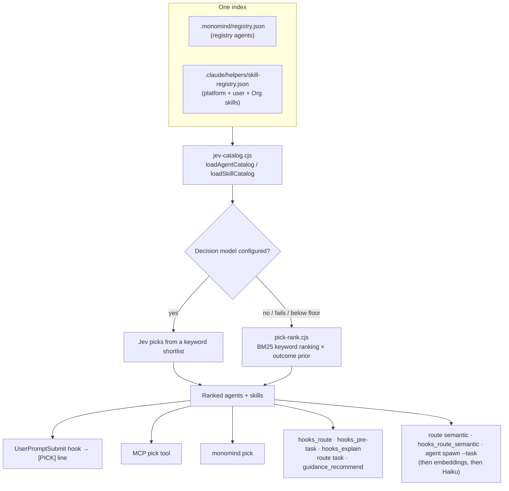

# Routing Subsystem

> **Version 2.9.0**  
> Routing in Monomind answers one question: which agent (and which skill) fits this task. Every selector asks the same **central picker** — one index of registry agents and skills, ranked by the Jev decision model when one is configured and by a BM25-style keyword ranker otherwise. The prompt hook delivers its answer to Claude as a `[PICK]` line, the `pick` MCP tool and `monomind pick` return it on request, and `hooks_route`, `hooks_pre-task`, `hooks_explain`, `route task` and `guidance_recommend` are wrappers over it. The embedding-based route layer (`@monoes/routing`: regex pre-filter, cosine similarity, Haiku fallback) runs only for `route semantic`, `hooks_route_semantic` and `agent spawn --task`, and only after the picker has no confident answer.
>
> Picks feed a small learning loop: the hooks log whether a spawned subagent followed the pick and whether it succeeded, and that history re-ranks near-tied keyword picks within ±15 %. There is no reinforcement learning here: no Q-table, no exploration, no trained model.

---

## 1. Architecture Overview



| Layer | Location | Role |
|---|---|---|
| Catalog loaders | [`.claude/helpers/jev-catalog.cjs`](.claude/helpers/jev-catalog.cjs), wrapped for TypeScript by [`decision/catalogs.ts`](packages/@monomind/cli/src/decision/catalogs.ts) | One implementation of "which agents and skills exist", shared by the hook and the CLI |
| Keyword ranker | [`.claude/helpers/pick-rank.cjs`](.claude/helpers/pick-rank.cjs) | The no-model ranking, and the shortlist Jev chooses from |
| Decision model client | [`.claude/helpers/jev-picker.cjs`](.claude/helpers/jev-picker.cjs), [`decision/jev.ts`](packages/@monomind/cli/src/decision/jev.ts) | Jev providers, confidence floors, timeouts |
| Ranking | [`decision/picks.ts → rankForTask`](packages/@monomind/cli/src/decision/picks.ts#rankForTask) | Jev answer or keyword ranking, per list (agents, skills) |
| Selectors | [`routing/agent-pick.ts → pickForTask`](packages/@monomind/cli/src/routing/agent-pick.ts#pickForTask), [`commands/pick.ts`](packages/@monomind/cli/src/commands/pick.ts), [`mcp-tools/pick-tools.ts`](packages/@monomind/cli/src/mcp-tools/pick-tools.ts) | What callers use |
| Prompt hook | [`.claude/helpers/handlers/route-handler.cjs`](.claude/helpers/handlers/route-handler.cjs), [`.claude/helpers/handlers/pick-core.cjs`](.claude/helpers/handlers/pick-core.cjs) | Per-prompt pick, `[PICK]` delivery, route records, adherence |
| Learning loop | [`.claude/helpers/pick-stats.cjs`](.claude/helpers/pick-stats.cjs), [`decision/pick-stats.ts`](packages/@monomind/cli/src/decision/pick-stats.ts) | Outcome aggregation and the bounded ranking prior |
| Route layer | [`packages/@monomind/routing/src/`](packages/@monomind/routing/src/) (`@monoes/routing`), [`routing/route-layer-factory.ts`](packages/@monomind/cli/src/routing/route-layer-factory.ts) | Regex pre-filter, embeddings, Haiku fallback — after the picker |

---

## 2. The Index: Agents and Skills

### Agents

Agents come only from the project's agent registry, `.monomind/registry.json`, built from `.claude/agents/**/*.md` (plus any extra agent roots, which win slug conflicts) by `registry-builder.ts`. The registry is built for the project root, rebuilt and awaited when it is missing or older than the agent files, written atomically, and never replaced by an empty one.

[`jev-catalog.cjs → loadAgentCatalog`](.claude/helpers/jev-catalog.cjs#loadAgentCatalog) turns it into candidates. Each agent's text is its one-line `when_to_use` followed by its description, plus its category, tags, capabilities, task types and vibe. Agents marked `deprecated: true` are left out of ranking but can still be spawned by name. Every agent carries `when_to_use`, `tags` and one `category`: core, architecture, engineering, testing, security, devops, github, marketing, design, coordination, data-ai or specialized.

A pick always names the agent's frontmatter `name` — the value Claude Code's Task tool accepts as `subagent_type` (for example `coder` or `Security Engineer`). The registry slug is kept as `id`.

### Skills

Skills come from one generated index, `.claude/helpers/skill-registry.json`, written by [`build-skill-registry.cjs`](.claude/helpers/build-skill-registry.cjs#build). It holds:

- **platform skills**: the project's `.claude/skills` and `.claude/commands`, invoked directly (`/mastermind:plan`, `Skill("monodesign")`);
- **user skills**: `~/.claude/skills`, for names the project lacks (`origin: "user"`);
- **Org library skills** (`orgSkills`): bundled, `~/.monomind/org-skills`, project and active catalog skills, read with the `org_skill_show` MCP tool (their `invoke` is `mcp__monomind__org_skill_show {"name":"<name>"}`), or `npx -y monomind org skills show <name>` without MCP.

README, overview and reference pages, `_`-prefixed includes and helper-only skills (`type: helper`) are not entries. The index is generated per machine — by `monomind init`, `monomind init upgrade`, `monomind pick` and the SessionStart hook whenever a source tree is newer — and is no longer shipped or committed (it is gitignored).

[`jev-catalog.cjs → loadSkillCatalog`](.claude/helpers/jev-catalog.cjs#loadSkillCatalog) returns one list: platform skills first (command and skill mirrors of one capability collapse to the slash form), then Org skills whose name is not already taken by a platform skill, a known alias of one (`systematic-debugging` → `mastermind-debug`, `writing-plans` → `mastermind-plan`, …) or an agent. Ranked skills carry `source: "platform"` or `"org"` and an `invoke` string. A catalog-projected platform skill, and a catalog skill in the Org list, pass only while the catalog entry is active with the `jev` target (for an Org skill, also only while its package verifies; see [Skill Catalog](./catalog.md)).

A skill can declare `pick: low` in its frontmatter. Admin and meta skills (org management pages and similar) do, so they rank below an equally matching entry and surface only when the task names them.

---

## 3. Ranking

### Keyword ranking

[`pick-rank.cjs`](.claude/helpers/pick-rank.cjs) scores each catalog item against the task, BM25-style:

- stopwords are dropped and words are lightly stemmed (`test`, `tests`, `testing`, `tester` meet);
- each query word is weighted by its rarity across the catalog (IDF);
- description matches saturate and are normalised by description length, so a long description does not win by size;
- a word in the item's name or id adds a fixed bonus, except a category prefix shared by many ids (`engineering-`, `mastermind-`);
- the total is scaled by the share of task words the item matches;
- a `pick: low` item keeps 35 % of its score.

Only items with some overlap are returned. The same ranker builds the shortlist (up to 30 candidates) the decision model chooses from.

### Decision model (Jev)

When `MONOMIND_JEV_URL` (self-hosted OpenJev) or `TYPESAFE_API_KEY` + `MONOMIND_JEV_HOSTED=1` (hosted TypeSafe) is set, [`rankForTask`](packages/@monomind/cli/src/decision/picks.ts#rankForTask) asks the model to rank the shortlisted agents and skills. Two floors apply to its answer:

| Floor | Env var | Default | Used by |
|---|---|---|---|
| Automatic | `MONOMIND_JEV_MIN_CONFIDENCE` | 0.6 | Callers that act on the answer unattended: the `[PICK]` line, the route layer, org auto-assignment |
| Pick | `MONOMIND_JEV_PICK_MIN_CONFIDENCE` | 0.25 | Rankings a person or Claude reads: `monomind pick`, the `pick` MCP tool and its wrappers |

An answer between the two floors is kept and flagged `lowConfidence: true`. Below the pick floor (or with no model, a timeout or a provider error) the list falls back to keyword ranking. Jev tail entries under probability 0.02 are dropped. Each list reports `method` (`jev` or `keyword`) and `source`: `jev`, `keyword` (no model configured) or `keyword-fallback` (a model was asked but gave no usable answer).

`doctor -c jev` probes the configured providers.

---

## 4. Delivery: the `[PICK]` Line

The `UserPromptSubmit` hook ([`route-handler.cjs`](.claude/helpers/handlers/route-handler.cjs)) picks for every user prompt and, when it is confident, prints one line into Claude's context:

```
[PICK] agent: Security Engineer · skill: /mastermind:review
```

- **Agent**: a Jev answer that clears the automatic floor, else the top keyword agent when its relevance score is at least 2 and at least 1.5× the runner-up ([`pick-core.cjs → decide`](.claude/helpers/handlers/pick-core.cjs#decide)).
- **Skill**: a confident Jev skill answer (including a confident "none fits"), else the top keyword skill when its score is at least 3 and at least 1.25× the runner-up. Keyword skills are ranked by the same `pick-rank.cjs` shortlist over the same skill catalog as the CLI (platform, user and Org-library skills; `pick: low` skills rank below equal matches).
- Ties and weak overlap print nothing: a wrong pick in context costs more than none.
- The line is printed even under `MONOMIND_HOOK_QUIET=1`. It is the hook's answer, not an advisory banner.
- Prompts Claude Code submits itself — task notifications, reminder-only turns, slash-command expansions and local-command output — get no pick and no record ([`pick-core.cjs → isSystemPrompt`](.claude/helpers/handlers/pick-core.cjs#isSystemPrompt)).
- Trivial prompts (fewer than three content words, such as "hi" or "thanks") get no pick and no record; the session's earlier route stays.
- The hook does not use `router.cjs`; its old keyword agent table is gone.

The hook waits for Jev up to `MONOMIND_JEV_HOOK_TIMEOUT_MS` (default 1500, max 10000). After a failed or timed-out pick it skips Jev for 5 minutes (`.monomind/jev-breaker.json`).

The generated `CLAUDE.md` tells Claude to use a `[PICK]` line's agent and skill unless clearly wrong, and to call `mcp__monomind__pick` (or `monomind pick`) before choosing a subagent itself. The mastermind skills and commands pick specialists the same way: the `[PICK]` line, then the `pick` MCP tool, then a local `monomind pick` (never through `npx`), then a fallback of agents that exist.

### Route records

Every user prompt is recorded, with or without a confident pick, by [`pick-core.cjs → persistRoute`](.claude/helpers/handlers/pick-core.cjs#persistRoute):

- `.monomind/route-outcomes.jsonl` — `routeId`, `sessionId`, a prompt hash and a secret-redacted 120-character preview, the picked agent and skill, `method`, `provider`, `confidence`, the top candidates, and `shown` (whether a `[PICK]` line was printed);
- `.monomind/routes/<sessionId>.json` — the session's latest pick, so concurrent sessions do not read each other's picks;
- `.monomind/last-route.json` — the latest pick overall, for the statusline.

Appends, outcome joins and rotation of `route-outcomes.jsonl` — by the hook and by `hooks_route` — all hold one lock file (`route-outcomes.jsonl.lock`, broken after 10 s), so concurrent sessions never drop each other's records. A slash-command route names no agent, so it never counts as a recommendation.

---

## 5. Selectors

All of these rank through [`pickForTask`](packages/@monomind/cli/src/routing/agent-pick.ts#pickForTask) → `rankForTask` over the same catalogs, and every agent they return is a spawnable name.

| Selector | Shape |
|---|---|
| `mcp__monomind__pick` ([`pick-tools.ts → pickTool`](packages/@monomind/cli/src/mcp-tools/pick-tools.ts#pickTool)) | Input `{ task, kind?: "agents" \| "skills" \| "both", categories?, top?: 1-20 }`; returns the same JSON as `monomind pick --json` plus a one-line `summary` (`agent: <name> · skill: <invoke>`) |
| `monomind pick -t "<task>"` ([`commands/pick.ts`](packages/@monomind/cli/src/commands/pick.ts)) | `--agents`/`--skills`, `--categories`, `--top N` (1-50), `--min-confidence P`, `--explain` (how the outcome prior moved each keyword score, plus the pick history), `--json` |
| `hooks_route`, `monomind hooks route` | `primaryAgent`/`alternativeAgents` as `{ type, confidence, reason }`; `topK` 1-20. The `useSemanticRouter` input is gone |
| `hooks_pre-task`, `hooks_explain` | Suggested agents / the explanation of the same pick |
| `monomind route task` | Routed through `createKeywordRouter`, which now delegates to the picker; `route list-agents` lists the registry |
| `guidance_recommend` | A top-level `agents` array (`{ name, confidence, reason }`) from the picker; capability areas no longer list agents |
| `agent spawn --type` | Accepts registry names, plus aliases for the old fixed types (`architect` → `Software Architect`, `security-auditor` → `Security Engineer`, …) |

When nothing ranks, the wrappers answer `coder`.

`monomind pick --json` returns:

```json
{
  "provider": "typesafe",
  "agents": { "method": "jev", "source": "jev", "lowConfidence": false,
              "ranked": [{ "id": "engineering-security-engineer", "name": "Security Engineer", "probability": 0.81 }] },
  "skills": { "method": "keyword", "source": "keyword-fallback", "lowConfidence": false,
              "ranked": [{ "id": "mastermind:review", "invoke": "/mastermind:review", "source": "platform", "score": 5.2 }] }
}
```

The outcome prior (section 7) re-ranks keyword agent results in every selector: the prompt hook, `monomind pick`, the MCP `pick` tool and the wrappers all read the project's `.monomind/pick-stats.json`, so they return the same order for the same task.

---

## 6. The Route Layer (`route semantic`, `hooks_route_semantic`, `agent spawn --task`)

[`route-layer-factory.ts → createConfiguredRouteLayer`](packages/@monomind/cli/src/routing/route-layer-factory.ts#createConfiguredRouteLayer) runs, in order:

0. **Picker, decision model** ([`pick-step.ts → pickRoute`](packages/@monomind/cli/src/routing/pick-step.ts#pickRoute)): Jev over the registry agents, with the `@monoes/routing` keyword hit always a candidate. Kept only at or above the automatic floor, since `agent spawn --task` acts on it. Returns `method: 'jev'`.
1. **`@monoes/routing` keyword pre-filter** ([`keyword-pre-filter.ts`](packages/@monomind/routing/src/keyword-pre-filter.ts#DEFAULT_KEYWORD_ROUTES)): 24 curated regex rules (security/CVE, test files, Docker/Kubernetes/CI, git, Solidity, MCP, React Native, Swift, Kotlin, embedded, SEO, supply chain, GraphQL, databases). `confidence: 1.0`, `method: 'keyword'`.
1b. **Picker, keyword ranking**, when its top agent clears the `[PICK]` bar (score ≥ 2, 1.5× lead).
2. **Real-embedding cosine similarity** in an isolated worker (`embed-worker.ts`; the ~88 MB `Snowflake/snowflake-arctic-embed-xs` model, downloaded only on request). Route centroids are averaged from each route's utterances; a match at or above the threshold returns `method: 'semantic'`.
3. **Haiku fallback** below the threshold ([`llm-fallback.ts → classify`](packages/@monomind/routing/src/llm-fallback.ts#classify)): a headless Claude Code call with a capability index (max 8000 chars) and the top three semantic candidates. A valid answer returns `method: 'llm_fallback'`, `confidence: 0.85`; an invalid or unknown one returns the nearest centroid as `method: 'semantic_degraded'`.
4. **Degraded path** when the worker fails: the dependency-free hash encoder (`LocalEncoder`, 256-D) plus the Haiku fallback. Routing always returns.

Every `@monoes/routing` route and keyword rule names a spawnable agent (`routing/src/__tests__/agent-slugs.test.ts`). As of `@monoes/routing` 1.1.0, routes and rules whose agent does not exist were removed rather than pointed elsewhere: the game-development routes and the Blender/Unreal/Unity/Godot rules, Salesforce, TikTok, LinkedIn and the ZK-proof rule.

---

## 7. Outcome Tracking and the Learning Loop

### What is logged

| File | Written by | Holds |
|---|---|---|
| `.monomind/route-outcomes.jsonl` | UserPromptSubmit (and `hooks_route`, `hooks_route_semantic`, `route feedback`) | One record per pick (section 4); joined later with `agentActuallyUsed` and `subagentSuccess` |
| `.monomind/pick-adherence.jsonl` | PreToolUse `Task\|Agent` ([`pick-core.cjs → recordAdherence`](.claude/helpers/handlers/pick-core.cjs#recordAdherence)) | Per spawn: the session's latest pick, the `subagent_type` actually spawned, `followed` |
| `.monomind/routing-feedback.jsonl` | SubagentStop | The agent that ran (`actualAgent`, from the event's `agent_type`), the pick (`suggestedAgent`), `followed`, success |

The adherence hook only observes; it never blocks a spawn. Only a real spawn sets `agentActuallyUsed` — nothing fills it in from the pick itself.

### The prior

[`pick-stats.cjs`](.claude/helpers/pick-stats.cjs#update) folds new lines from all three logs into `.monomind/pick-stats.json` at SubagentStop and SessionEnd (incrementally, by byte cursor). For each agent with at least 5 observations it computes a factor in [0.85, 1.15] from smoothed success and adoption rates; [`applyPriors`](.claude/helpers/pick-stats.cjs#applyPriors) multiplies the keyword score by it. A zero score stays zero, and the largest swing (1.15 / 0.85 ≈ 1.35) is below the 1.5× lead a `[PICK]` needs, so the prior breaks near-ties but never overturns a clear relevance gap. Jev rankings are not re-ranked.

`monomind pick --explain` shows each keyword score as `score = baseScore × prior` and the history behind it; [`readPickStats`](packages/@monomind/cli/src/decision/pick-stats.ts#readPickStats) is the programmatic summary. Org runs apply the same idea to role and skill near-ties from the run's own finished tasks (see [Org Runtime](./org-runtime.md)).

### Ledger commands

[`monomind route stats`](packages/@monomind/cli/src/commands/route.ts#statsCommand) reports accuracy, adherence and trend from `route-outcomes.jsonl` (`computeRoutingAccuracy()` / `computeAdherence()` in [`route-outcomes.ts`](packages/@monomind/cli/src/monovector/route-outcomes.ts)). `route feedback` appends a reward (−1.0 to 1.0) for a task/agent pair; `route reset` clears the ledger; `route export`/`import` move it to and from a JSON file (50 MB cap, path containment checked).

---

## 8. Dynamic Complexity Scoring

`hooks_route` and `hooks_pre-task` attach a complexity estimate ([`hooks-routing.ts`](packages/@monomind/cli/src/mcp-tools/hooks-routing.ts#hooksRoute)):

- **`high`**: more than 200 characters, or contains `complex` / `architecture`. Duration: 2-4 hours.
- **`low`**: fewer than 50 characters, or contains `simple` / `fix`. Duration: 10-30 min.
- **`medium`**: everything else. Duration: 30-60 min.

[`monomind route coverage`](packages/@monomind/cli/src/commands/route.ts#coverageRouteCommand) ranks coverage gaps (`targetCoverage - currentCoverage`), priority (1-10) and estimated effort, and assigns each gap to a registry agent.

---

## 9. Evaluation, Doctor and Tests

- **`pnpm run pick:eval`** ([`scripts/pick-eval.mjs`](scripts/pick-eval.mjs)) scores 60 tasks in `tests/pick-eval/` (`dataset.json` + `holdout.json`, each listing every acceptable agent and skill) as top-1/top-3 hits. It runs the keyword ranker in-process over the built CLI; `--jev` ranks through `rankForTask` with the shell's decision-model env; `--catalog frozen` uses `tests/pick-eval/catalog-snapshot.json`. On the frozen catalog the keyword ranker gets agents 47/60 top-1 and skills 49/59; with Jev, 59/60 and 58/59. (Before this work, on the original 40 tasks: keyword 23/40 agents and 27/40 skills, Jev 34/40 and 39/40.) `tests/pick-eval/pick-eval.test.ts` holds a floor on the frozen catalog in CI.
- **`monomind doctor -c pick`** ([`doctor-pick-checks.ts → checkPick`](packages/@monomind/cli/src/commands/doctor-pick-checks.ts#checkPick)), opt-in: registry agent count, duplicates and staleness; skill index freshness and counts (platform, org, user); whether a decision model is configured (no network); the keyword eval score when the project carries `tests/pick-eval`; `[PICK]` adherence; and subagent success when the pick was followed versus overridden. It rebuilds stale indexes, so it is not in the default run. `doctor -c registry` reports duplicate slugs and extra agent roots.
- **`pnpm run lint:agent-refs`** ([`scripts/lint-agent-refs.mjs`](scripts/lint-agent-refs.mjs)), in `verify` and CI: every `subagent_type`, `agentSlug` and `Skill(...)` name in shipped skills, commands, TypeScript generators and CLAUDE.md agent rosters must exist.
- **Route layer tests** (`packages/@monomind/routing/src/__tests__/`): `route-layer.test.ts`, `keyword-pre-filter.test.ts`, `llm-fallback.test.ts`, `encoder.test.ts`, `cosine.test.ts`, `capability-index.test.ts`, `agent-slugs.test.ts`.
- **Picker tests**: `packages/@monomind/cli/__tests__/decision/` (`pick-rank`, `catalog-parity`, `agent-registry`, `picks`), `packages/@monomind/cli/src/__tests__/pick-mcp-tool.test.ts` and `pick-wrappers.test.ts`, and the hook tests `tests/hooks/pick-core.test.mjs`, `route-handler-pick.test.mjs`, `pick-adherence-hook.test.mjs`, `pick-stats.test.mjs`.
